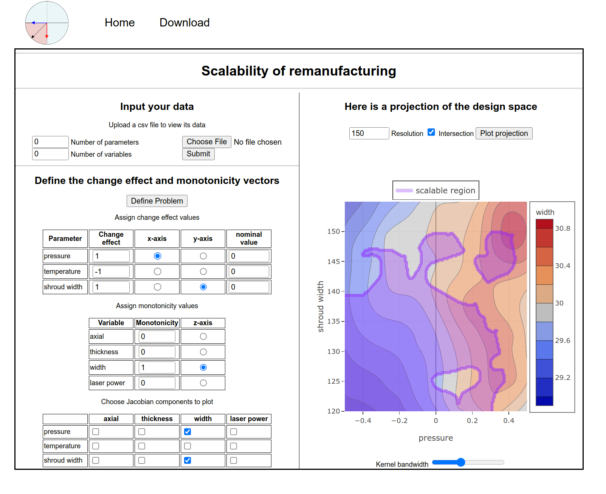

# scale_AM: a scalability assessment tool

## Quickstart guide

Go to the online [web tool](https://scale-am.herokuapp.com/) hosted on heroku.

### Raw data
Download example data sets shown below

| **File name**                                     | **Number of parameters**  | **Number of variables**   |
|---------------------------------------------------|-------------------------  |---------------------------|
| [himmelblau.csv](./static/data/himmelblau.csv)    | 2                         | 1                         |
| [trs_data.csv](./static/data/trs_data.csv)        | 3                         | 4                         |

### Choose appropriate settings
Choose x-axis, y-axis, and z-axis for the projection and hit `plot projection` and example for the `trs_data.csv` dataset is shown below:



## Development guide

**MacOS/Linux**

Clone the repo
```
git clone https://github.com/khbalhandawi/scale_AM_webapp.git
cd scale_AM_webapp
```

Create a virtual environment to develop this library

```
python -m venv .venv
source .venv/bin/activate
pip install -r requirements.txt
```

Execute the shell file [run_app.sh](./run_app.sh)

```
source run_app.sh
```

Navigate to your localhost in a browser at port `5000` [http://127.0.0.1:5000/](http://127.0.0.1:5000/) 